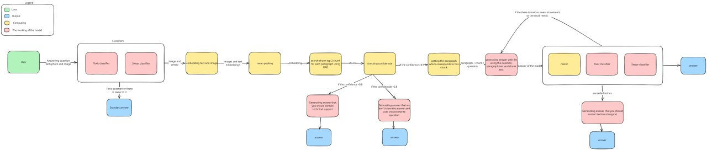
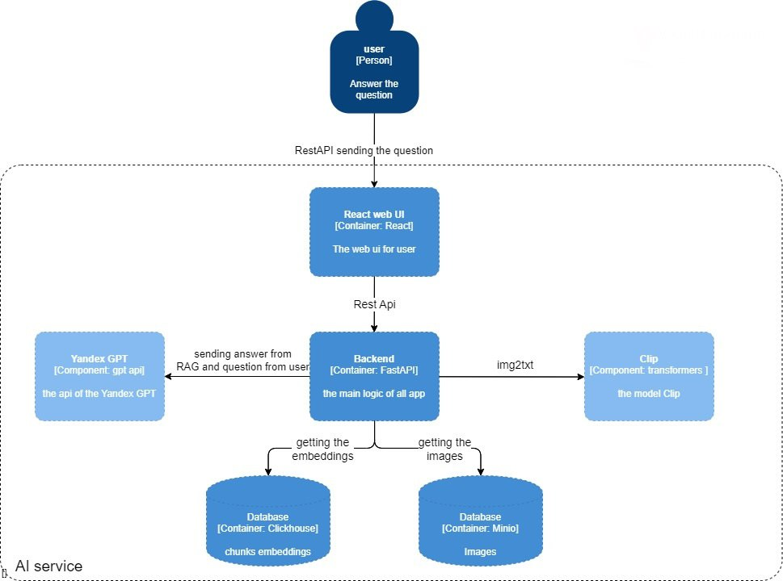

### Описание
Данный проект представляет собой чат-бота, предназначенного для улучшения взаимодействия с документацией. Используя Retrieval-Augmented Generation (RAG) и мультимодальные технологии, приложение помогает пользователям эффективно находить нужную информацию и получать точные ответы на вопросы. Уникальная архитектура позволяет боту бороться с галлюцинациями и фильтровать токсичный контент, обеспечивая безопасное и релевантное взаимодействие с пользователями.


## Основной стек технологий
- **FastAPI**: Веб-фреймворк для создания API
- **Next.js**: Фронтенд фреймворк для интерактивного интерфейса
- **PyTorch**: Фреймворк для глубокого обучения, используемый для обучения и запуска моделей машинного обучения
- **laion/CLIP**: Модель для работы с изображениями и текстом, обеспечивающая мультимодальные возможности
- **Toxic и swear-классификаторы**: Классификаторы для выявления токсичности и нецензурной лексики в запросах пользователей и ответах модели

## Уникальные особенности
- **Классификатор токсичных и нецензурных выражений**: Обеспечивает фильтрацию входящего и исходящего контента, создавая безопасную среду для пользователей.
- **Работа с изображениями и текстом**: Мультимодальные возможности позволяют боту отвечать на вопросы, анализируя изображения и текст.
- **Голосовой ввод**: Поддержка голосовых запросов для более удобного взаимодействия с пользователями.
- **Перегенерация при токсичном или несоответствующем ответе модели или маленьком соотвествие ответа и параграфа**: Повторная генерация ответа при выявлении неподобающего контента.
- **Детекция отсутствующей информации**: Определяет, когда запрашиваемая информация отсутствует в базе знаний, и отвечает стандартным ответом
- **Кастомная метрика**: Разработанная нами метрика помогает поддерживать высокое качество и релевантность ответов.
- **Ссылка на параграфы и отправка изображений**: Ответы содержат ссылки на соответствующие параграфы документации и возможность отправки изображений для повышения точности и полноты ответов.

### Пайплайн([ссылка](https://excalidraw.com/#json=b4I1pIZaxjXgU6brdCOz7,1SRKk9GyeHidZm5rAG3qWQ) для более подробного ознакомления)

### C4

### 1. Склонировать репозиторий

```bash
git clone https://github.com/IDWNTL/PFO-CP
cd PFO-CP
```

### 2. Скопировать .docker/.env.example в .docker/.env и заполнить переменные

```bash
cp .docker/.env.example .docker/.env
nano .docker/.env
```

### 3. Скопировать configs/.env.example в configs/.env и заполнить переменные

```bash
cp configs/.env.example configs/.env
nano configs/.env
```

### 4. Запустить скачивание моделей

```bash
make load-models
```

### 5. Запустить docker compose up --build

```bash
docker compose up --build
```

## Индексирование
Для индексирования на ручку `/api/v1/indexing`(можно запустить через swagger `core/docs/`) сделать запрос с docx файлом.

## ML
1. [Classification](./ml/classificators) - пайплайн работы с классификацией нецензурной и токсичной лексики
2. [Embedders](./ml/embedders.py) - класс для работы с эмбедингами
3. [Indexing](./ml/indexing.py) - функции для индексирования
4. [Documents](./ml/documents.py) - класс для работы с документами
5. [Chunkers](./ml/chunkers.py) - классы для работы с чанками